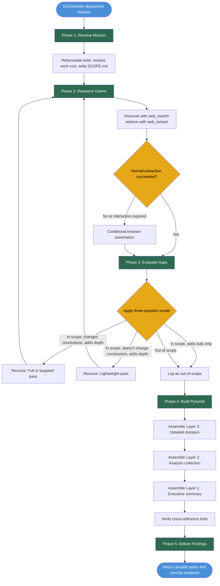

# Researcher Workflow — Decision Map

## Flow Notes

- Phases 1, 2, 4, and 5 are mandatory and sequential.
- Phase 3 is the only research branching point: it can loop back to Phase 2 for recursion.
- Recursion intensity ranges from lightweight discovery to a full multi-source pass.
- Maximum 2 recursion cycles before escalation.
- Browser automation is conditional on failed extraction or required interaction.
- Artifacts accumulate under the `<work-root>` resolved in Phase 1.
- The pyramid is built from bottom up: dossiers → analysis → summary.
